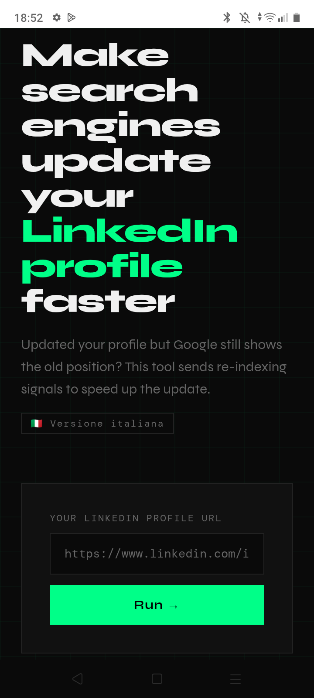
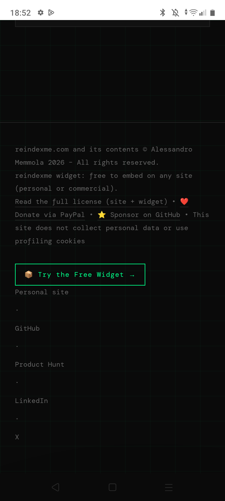
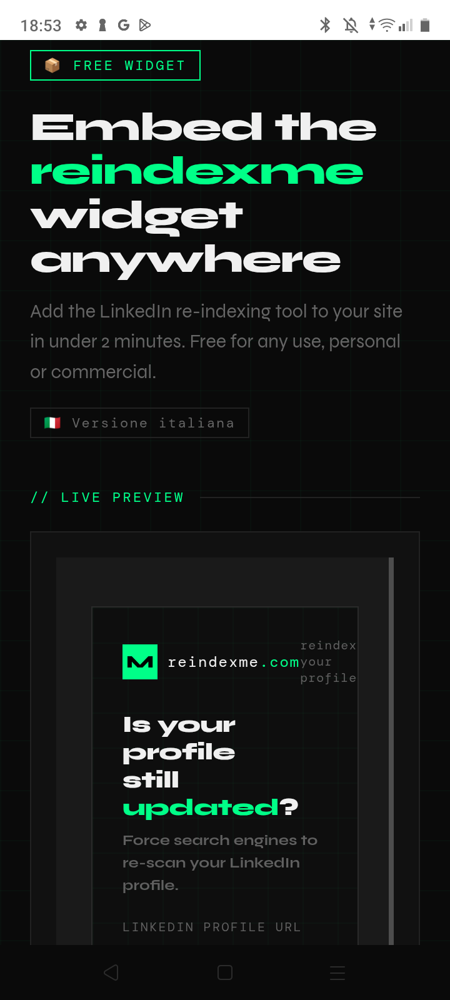
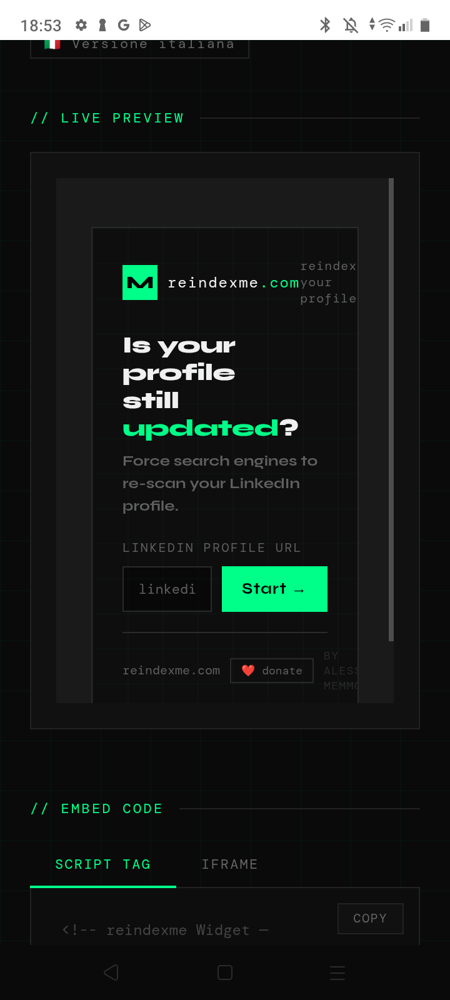
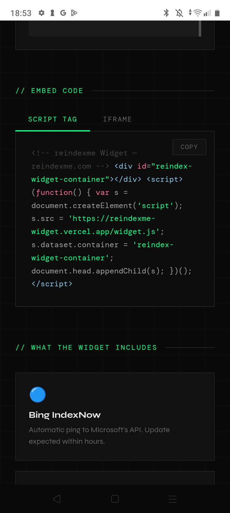
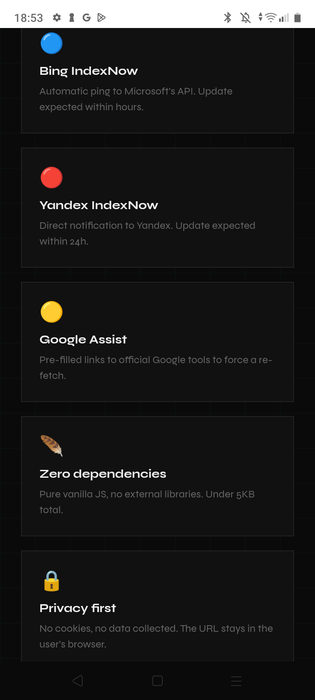
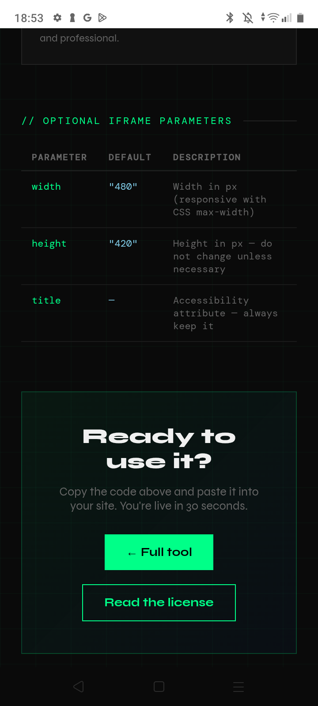

# ReIndexMe

Simple, privacy-first LinkedIn content refresh assistant with embeddable widget support.

ReIndexMe helps website owners, content creators, marketers, and developers streamline LinkedIn URL inspection workflows when shared content does not immediately update on the platform.

The project provides a lightweight public interface and an embeddable widget designed to simplify a common content publishing issue related to LinkedIn link previews and content updates.

ReIndexMe is a production tool actively maintained in real-world usage.

---

## Release

Latest version: [v1.0.0](https://github.com/alessandromemmola/reindexme/releases/tag/v1.0.0)

---

## Live Service

Website:

https://reindexme.com

Widget Demo:

https://reindexme.com/widget-demo.html

---

## Screenshots

 
 
 
 
 
 
 

---

## Overview

ReIndexMe was created to solve a practical issue frequently encountered by website owners and content publishers: LinkedIn sometimes continues displaying outdated previews after a page has been updated.

The service simplifies the process of requesting a fresh inspection of a URL through LinkedIn's public inspection workflow.

It does not replace LinkedIn's official tools, but makes the workflow easier to access, understand, and integrate into existing publishing processes.

The platform provides:

* Public web interface
* Embeddable widget
* Privacy-first architecture
* Lightweight deployment model
* Continuous maintenance and improvements

The project is actively developed and deployed in production.

---

## Features

### LinkedIn URL Inspection

Quick access to LinkedIn URL inspection workflows through a simple and accessible interface.

### Embeddable Widget

ReIndexMe includes a standalone widget that can be integrated into third-party websites.

The widget allows external websites to offer LinkedIn URL inspection functionality directly within their own pages.

### Privacy-First Design

The service intentionally minimizes data collection and avoids unnecessary tracking mechanisms.

### Lightweight Architecture

The project uses a minimal technology stack focused on reliability, maintainability, and performance.

---

## Usage

* Live production service
* Embeddable widget for third-party websites
* LinkedIn URL inspection workflows
* Content publishing and sharing support

---

## Project Goals

ReIndexMe is built around a small set of guiding principles:

* Simplicity over complexity
* Accessibility by default
* Privacy-first operation
* Open web standards whenever possible
* Minimal infrastructure requirements
* Long-term maintainability

The goal is not to replace publishing platforms or SEO tools, but to simplify a specific workflow that content creators and website owners regularly encounter when sharing updated content on LinkedIn.

--- 

## License 

Source code licensing information is available at: 

https://reindexme.com/license.html

For licensing questions, please refer to the license documentation. 
ReIndexMe is publicly available and free to use. The source repository is public, while the service and widget are distributed under a custom license designed to preserve free public access to the project.
